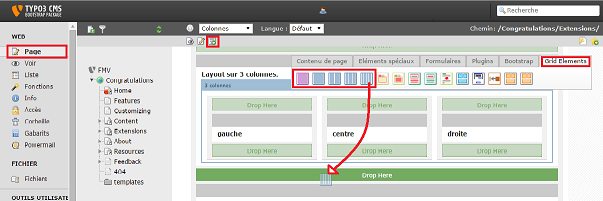

.. ==================================================
.. FOR YOUR INFORMATION
.. --------------------------------------------------
.. -*- coding: utf-8 -*- with BOM.

.. include:: ../Includes.txt

.. _user-manual:

Users Manual
============

Basic Usage
-----------

Setup a container
^^^^^^^^^^^^^^^^^

In "page" mode, click on "new content", find the "Gridelements" tab.
Drag & drop one of the column layouts to your page to create an element.
Click to edit the content, and pick say a medium breakpoint.

   How to setup a container

   The Backend view of TYPO3 after the user has clicked on module "Page".

Options
^^^^^^^

**Main reference guide**

- http://getbootstrap.com/css/#grid-intro

**Breakpoints**

Enable any of the 4 breakpoints. When activated, a new tab appair with settings for the activated breakpoint.

- http://getbootstrap.com/css/#grid-options

**Breakpoint width**

On active breakpoint(s) tab(s), you can setup the size of the columns. Each row does content 12 columns (this is the main grid). If you have say a 3 columns container, set each column of the container width to 4 (33,3% of the total width), so the total number of used columns remains 12. When offseting columns, take account of your offset so the total remains 12.

- **Column Width**:  Width of a container column on the main grid.
- **Column Offset**: Offset a container column on the main grid.
- **Column Pull**: In conjunction with column push, allow swapping container position depending on the breakpoint.
- **Column Push**: In conjunction with column pull, allow swapping container position depending on the breakpoint.
- **Add column reset**: On small devices you may want to put your content in two row instead of a single one. The columns reset allow safe line breaks between two columns on any layout (excluding largest).

**Visibility**

Activate visibility for each column at any breakpoint, eg: to hide a content on small screen.

- http://getbootstrap.com/css/#responsive-utilities-classes

**Custom CSS**

Here you may want to add custom css classes separated by a space.

.. important::
  Custom css classes should not modify the width of containers by adding padding, margins or borders. This will break the automatic width computation of images.

Advanced Usage
^^^^^^^^^^^^^^

**Column width**

- http://getbootstrap.com/css/#grid-example-basic
- http://getbootstrap.com/css/#grid-example-mixed
- http://getbootstrap.com/css/#grid-example-mixed-complete

**Column offset**

- http://getbootstrap.com/css/#grid-offsetting

**Column reset**

On small devices, we may want to break up layout in two clean rows. Think about a 4 columns layout. Keep the first two on the first row (with a total width of 12), add a column reset on the column 2, and set the width of the last two to a total of 12.

- http://getbootstrap.com/css/#grid-responsive-resets
- http://getbootstrap.com/css/#grid-example-wrapping

.. tip::
  - Columns reset only affect the breakpoint they belong. In order to affect more than one breakpoint, you have to enable every breakpoint where you want the reset.
  - Full width columns allready ensure a clean line break.
  - The main rule with reset is : try it first without and if it goes wrong, enable the reset.

**Column push and pull**

Change the columns ordering on some layouts. With say a 3 columns layout, on large devices, you may want the center column to stay left to the left column. So pull your center column the width of the left column and push the left  the width of the center column.

- http://getbootstrap.com/css/#grid-column-ordering

.. important::
  Column push and pull affect any breakpoint with bigger screen width. So **think your design for smallest device first**, and add push - pull to change it for larger ones.

**Nesting**

For a 6 columns layout simply nest 6 column container in a row.

.. _user-faq:

FAQ
---

Why a single column container ?
^^^^^^^^^^^^^^^^^^^^^^^^^^^^^^^

Single columns container allow to define column width and offset and hide content on some devices.

Why a fluid container ?
^^^^^^^^^^^^^^^^^^^^^^^

On templates without any container, contents like banner can take the whole width of the screen. A fluid container has fixed width and auto-margins to achieve responsive layouts. Nesting cloumns containers in the fluid container let the designer decide where the layout takes the whole screen and where it follow responsive grid rules.

